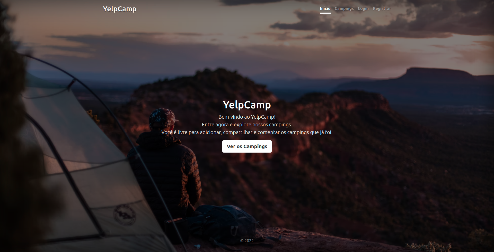

# Yelp Camp :tent:

YelpCamp is a responsive online platform which its users can add, comment and rate Campgrounds. The Campgrounds are pinned in MapBox's API Map automatically when created.

## [Live Access](https://mysterious-atoll-72579.herokuapp.com/)

### PT-BR:

O YelpCamp é uma plataforma online responsiva onde seus usuários podem adicionar, comentar e avaliar Campings, que são automaticamente localizados no mapa utilizando a API do MapBox.

Esse é o projeto final do curso "The Web Developer Bootcamp 2022" por Colt Steele na Udemy. Nele exercitei meus aprendizados em:

- **HTML**

- **CSS** (Bootstrap)

- **JavaScript** (EJS, Node.JS, Express)

- **MongoDB** + Mongoose

- **APIs** (REST)

- Arquitetura **MVC**

E pratiquei trabalhar com ferramentas que eu não tinha qualquer experiência anterior, como:

- **Passport** para autenticação, autorização e criptografia;

- **JOI** para validação de dados adicionados ao MongoDB via Mongoose;

- e o **EJS Mate** para acelerar meu processo de desenvolvimento de layouts utilizando um "boilerplate" para os views e partials do projeto

 

### EN:

This is the final project from Colt Steele's "The Web Developer Bootcamp 2022". In this project, I exercised my learnings in:

- **HTML**

- **CSS** (Bootstrap)

- **JavaScript** (EJS, Node.JS, Express)

- **MongoDB** + Mongoose

- **APIs** (REST)

- **MVC** architecture

And practiced working with tools that I have never had any experience before, like:

- **Passport** for authentication, authorization and cryptography

- **JOI** for data validation

- and **EJS Mate** made my development process a lot faster with boilerplating
